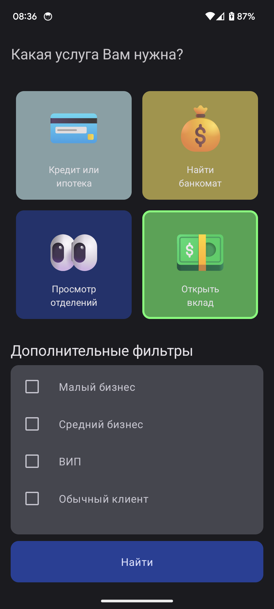
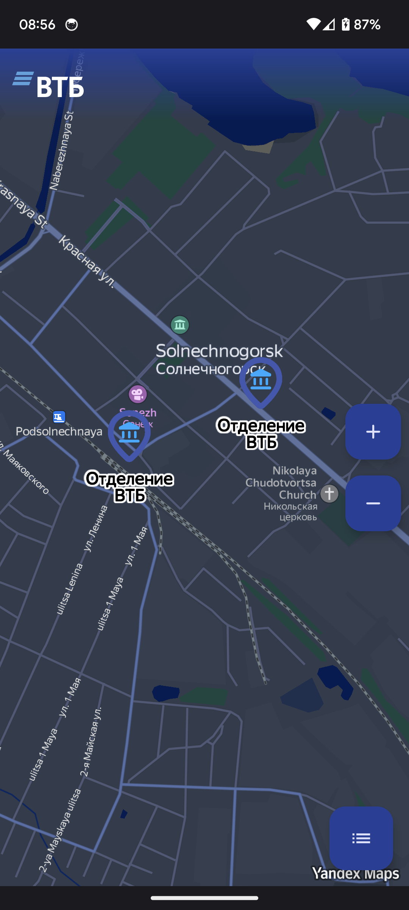
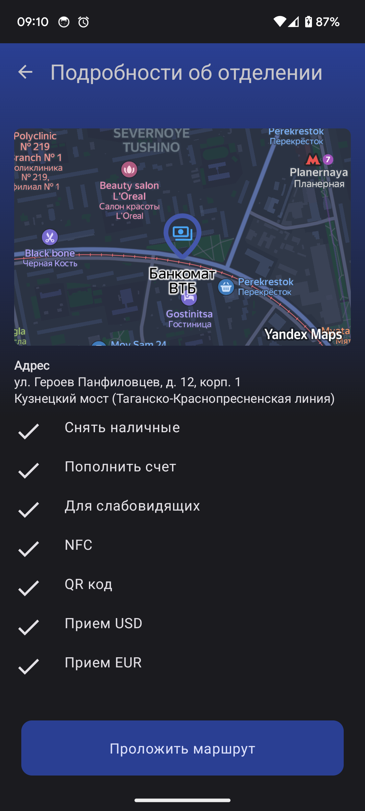
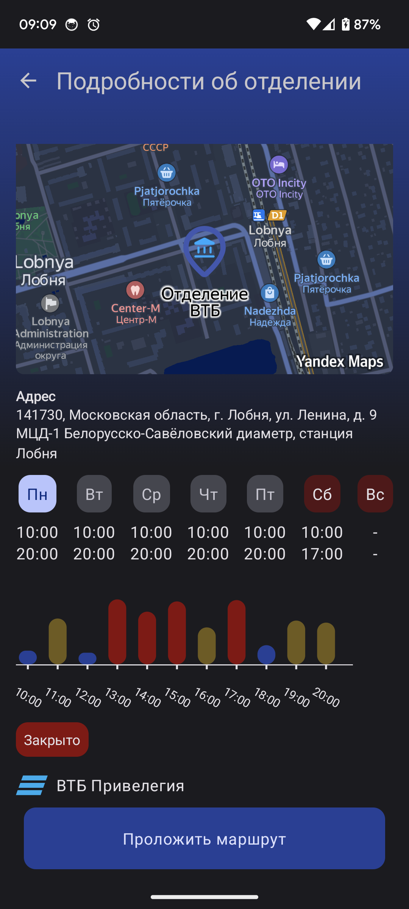

# Mobile app for MORE.Tech 5.0 Hackathon - MOBILE+WEB
# [Backend](https://github.com/Krutov777/more-tech-hackaton)

# How to run app?
1. Download [last release from github](https://github.com/qveex/more-tech5/releases) and install
2. Or clone repository, set `MAP_KIT_API_KEY` in `local.properties` for yandex maps and build project

# Stack:
- Kotlin
- Compose
- MVI
- Hilt
- Retrofit
- Kotlinx-serialization
- Coroutines
- Yandex maps
- YCharts

# Results:
|                      **Start Screen**                       |                       **Map Screen**                        |
|:-----------------------------------------------------------:|:-----------------------------------------------------------:|
|  |  |
|                       **ATM Screen**                        |                    **Department Screen**                    |
|  |  |
